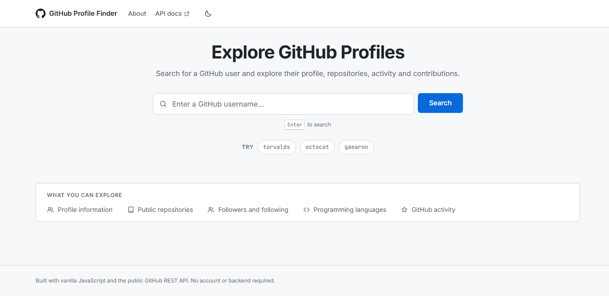
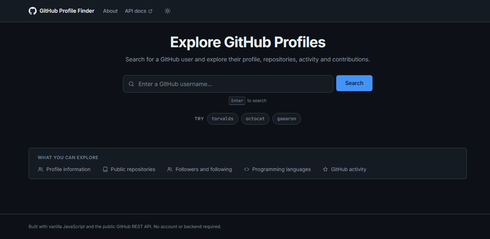
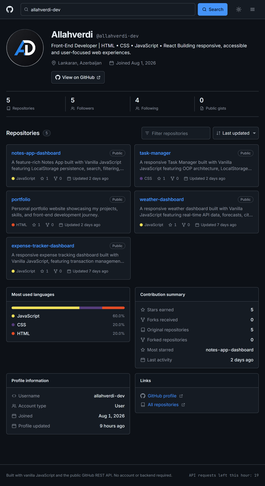
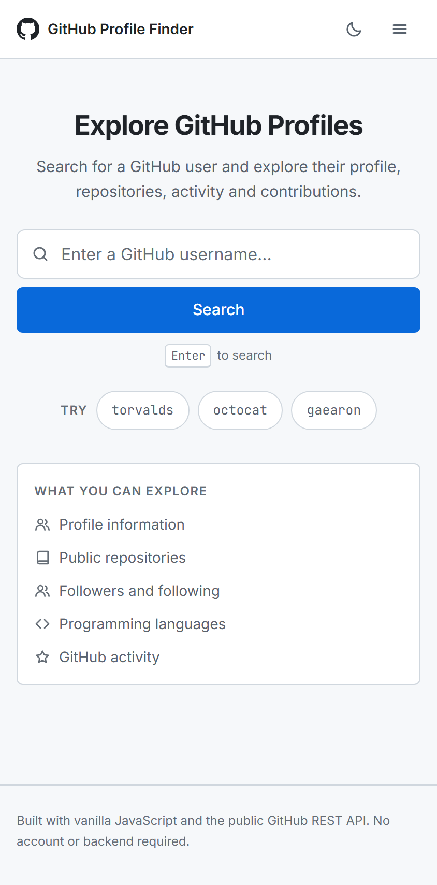
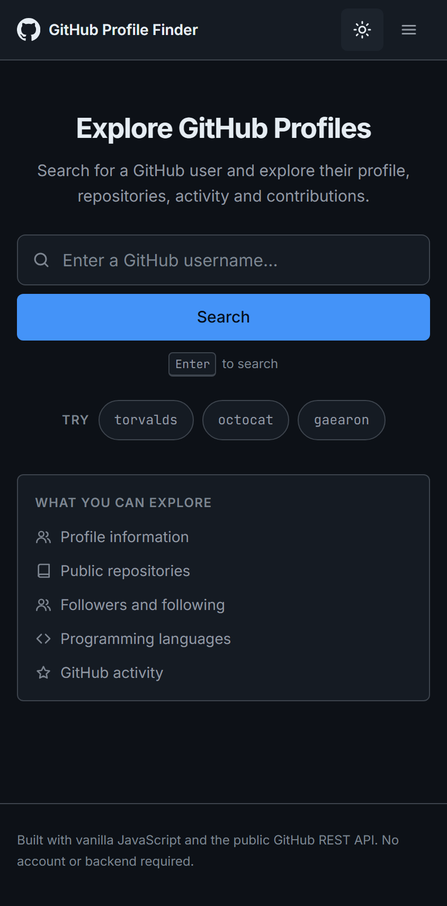

# GitHub Profile Finder

A client-side application for searching GitHub users and exploring their public profile and
repositories. It reads everything from the public GitHub REST API directly in the browser —
there is no framework, no build step and no backend of any kind. The entire application is one
HTML file, one stylesheet and one JavaScript file.

---

## Demo

```
https://YOUR-GITHUB-USERNAME.github.io/github-profile-finder/
```

> Placeholder. The repository has not been published yet — this URL will be updated after the
> GitHub Pages deployment.

---

## Screenshots

**Desktop — light and dark theme**

| Light | Dark |
| --- | --- |
|  |  |

**Profile and repository view**



**Mobile**

| Light | Dark |
| --- | --- |
|  |  |

---

## Features

**Search**
- Search any GitHub user by username, from the hero search or the compact header search
- Example usernames on the landing screen
- Username format is validated client-side, so obviously invalid input costs no API request
- Deep links via hash routing (`#/username`) that survive a refresh and the browser back button

**Profile**
- Avatar, name, username, bio, company, location, website and join date
- Repositories, followers, following and public gists in a statistics row
- Sidebar with most-used languages, a contribution summary (stars earned, forks received,
  original vs. forked repositories, most starred repository, last activity), profile facts and
  external links

**Repositories**
- Repository list with description, language and language colour, stars, forks and last update
- Text filter across name, description, language and topics
- Sorting by last updated, most stars, most forks, name (A–Z) and newest
- Load-more pagination, 12 repositories at a time
- Details modal: owner, description, stars, forks, open issues, watchers, created and updated
  dates, default branch, licence, visibility, topics and the repository URL

**Interface states**
- Skeleton loading state while a profile is being fetched
- Empty state when a filter matches nothing, and when an account has no public repositories
- User-not-found state with a retry search field
- API error state with a "Try again" action, covering network failures, unexpected responses and
  rate limiting
- Toast notifications
- Light and dark theme, stored in `localStorage` and applied before first paint, defaulting to
  the operating system preference
- Responsive layouts for desktop, tablet and mobile

**Accessibility**
- Full keyboard operation, focus trapping in dialogs and status announcements for screen readers
  (see the [Accessibility](#accessibility) section)

---

## Tech stack

| Technology | Usage |
| --- | --- |
| HTML5 | Semantic application structure, inline SVG icon sprite |
| CSS3 | Layout, responsive design and theming via custom properties |
| JavaScript | Application logic, state and API integration (no modules, no transpiler) |
| GitHub REST API | Public profile and repository data |
| Google Fonts | Inter and JetBrains Mono, loaded over the network with system-font fallbacks |

No npm packages, CSS framework or icon library are used. Google Fonts is the only external
resource besides the API; the interface falls back to system fonts if it is unavailable.

---

## GitHub API

The application calls the public GitHub REST API directly from the browser. Two endpoints are
used:

```
GET https://api.github.com/users/:username
GET https://api.github.com/users/:username/repos?per_page=100&sort=updated&page=:n
```

No API token, authentication or server-side component is required for the current
implementation. Repository pages are requested in parallel and de-duplicated by repository id,
and accounts with no public repositories skip the repository request entirely.

---

## API rate limit

- GitHub allows **60 unauthenticated requests per hour per IP address**.
- A single search costs one request for the profile, plus one request per 100 repositories
  (capped at 3 pages, so at most 300 repositories are listed).
- This is intentionally a front-end-only project, so no server-side proxy and no personal access
  token are used — a token shipped in client-side code would be a published token.
- A public demo can therefore reach the rate limit temporarily, particularly on shared networks.
  The remaining request budget is shown in the footer, and the error state reports when the limit
  resets.

---

## Responsive design

Layouts were checked at the following viewport widths, with no horizontal overflow at any of
them:

| Width | Layout |
| --- | --- |
| 320px, 375px, 390px | Single column, full-width search row, 2×2 statistics grid, full-width repository cards, sheet-style modals |
| 768px | Single column with the sidebar below the repositories in a two-up grid |
| 1024px | Two columns, narrower sidebar |
| 1280px, 1440px | Two columns, 1240px maximum content width, sticky sidebar |

---

## Accessibility

Accessibility was considered during development and tested manually — this is not a formal
audit or a WCAG conformance claim.

- Semantic landmarks (`header`, `main`, `footer`, `nav`), a skip link and a consistent heading
  order
- Every interactive control has an accessible name; decorative icons are `aria-hidden`
- Visible focus rings on all interactive elements, and larger touch targets on coarse pointers
- Repository cards are keyboard-operable and open with `Enter` or `Space`
- Dialogs use `role="dialog"` with `aria-modal`, trap `Tab`, close on `Escape` or a backdrop
  click, and return focus to the element that opened them
- Search results, filter match counts and errors are announced through a polite live region
- Text colours were measured at 4.9:1 or better against their backgrounds in both themes
- `prefers-reduced-motion` disables the skeleton shimmer and interface transitions

---

## Project structure

```text
github-profile-finder/
├── css/
│   └── styles.css      design tokens, components, responsive layers
├── js/
│   └── app.js          API layer, state, rendering, routing, modal, theme
├── screenshots/        images used in this README
├── index.html          all screens and states, plus the inline SVG icon sprite
├── README.md
├── LICENSE
└── .gitignore
```

`js/app.js` is organised top-down: helpers, state, theme, toasts, API, search flow, rendering,
modal, event wiring and routing.

---

## Getting started

Clone the repository and serve the folder with any static HTTP server:

```bash
python -m http.server 5173
```

Then open:

```text
http://localhost:5173
```

Serving over a local HTTP server is recommended rather than opening `index.html` from the file
system, so that hash routing and API requests behave the same way they will in production.
There is nothing to install and no build step.

---

## Deployment

The project is a static site — no backend, no build step and no server-side rendering — so the
repository can be deployed as-is. GitHub Pages is the intended target: enable Pages for the
repository root and the application is live. Any static host works the same way.

---

## License

Released under the [MIT License](LICENSE).

---

## Author

**Allahverdi**
